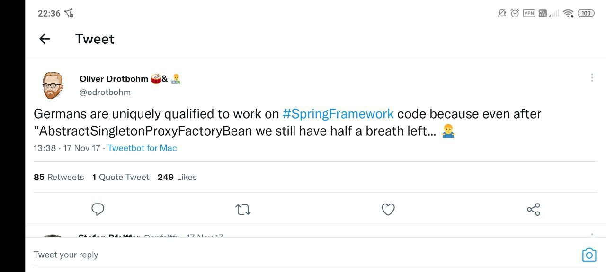

== Spring 🌱

https://twitter.com/odrotbohm/status/931471626339831808

== Демо

* https://start.spring.io
* Spring Boot:
+
> Spring Boot makes it easy to create stand-alone, production-grade Spring based Applications that you can "just run".

== Dependency Injection 💉

https://habr.com/ru/post/350068/[Статья на Хабре]

=== Recap

* `@Component`
* `@Bean`
* `@Scope`

https://stackoverflow.com/questions/6827752/whats-the-difference-between-component-repository-service-annotations-in

== Web 🌏

* Смотрим только на Web MVC
* WebFlux пропускаем
* `@RestController`, json, `@Controller`

== Data 📚

=== Миграции

=== Зачем и как

==== Зачем

===== На пальцах

«Чтобы не страдать с обновлением схемы БД»

==== Как

. Пишем скрипты обновления
. Мигратор сам обновляет БД

=== Чем мигрировать

* Flyway
* Liquibase

== Базы данных и Enterprise разработка

. `DataSource`
. Поменьше boilerplate кода
.. А можно почти не писать код.
Это не шутка!
. Транзакции 😭
. Фреймворки и библиотеки
.. JdbcTemplate Spring'а
.. Spring Data
.. JPA, Hibernate 😭 😭 😭

=== Spring Data JDBC

* Это не `JdbcTemplate`
* Это мини-ORM:
+
> Spring Data JDBC aims at being conceptually easy.
In order to achieve this it does NOT offer caching, lazy loading, write behind or many other features of JPA.
This makes Spring Data JDBC a simple, limited, opinionated ORM.

=== Демо

== Ссылки

. https://www.manning.com/books/spring-in-action-fifth-edition[Spring in Action, Fifth Edition]
. https://spring.io/guides[Spring Guides]
. https://docs.spring.io/spring-framework/docs/current/reference/html/[Spring Reference Documentation]
. Google + «Евгений Борисов Spring»